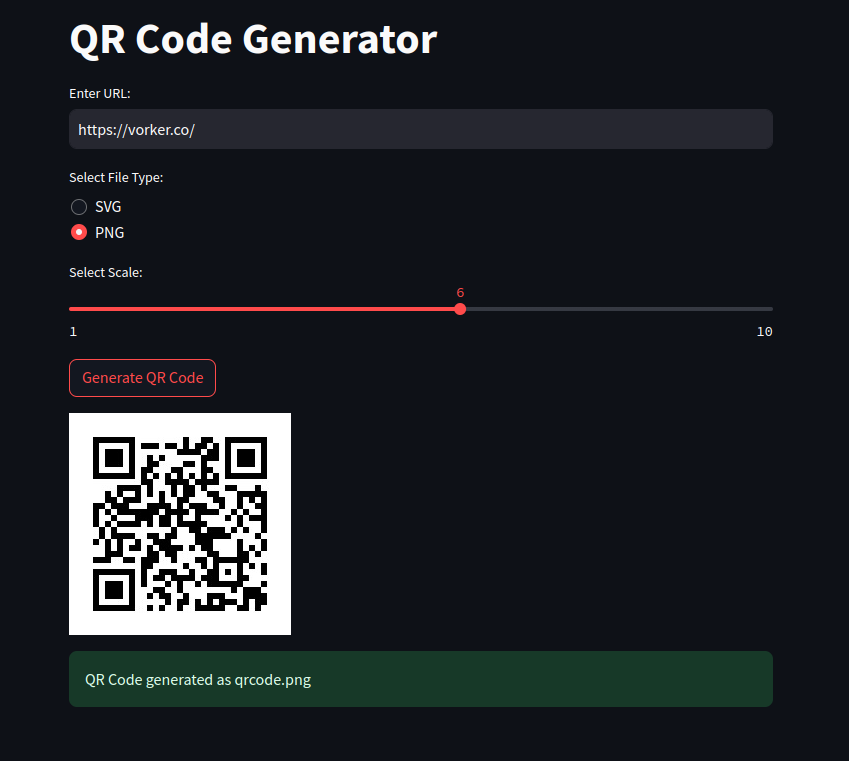

This program is a simple QR code generator built using Streamlit and PyQRCode. It provides users with a convenient interface to generate QR codes from URLs they input. Users can specify the URL, choose between generating a QR code in SVG or PNG format, and adjust the scale of the QR code using a slider. Once the user clicks the 'Generate QR Code' button, the program creates the QR code based on the specified parameters and displays it on the interface. Additionally, it gives a success message confirming the generation of the QR code along with the filename for easy identification and retrieval.

https://huggingface.co/spaces/muhammadnasar/qrcodegenerator