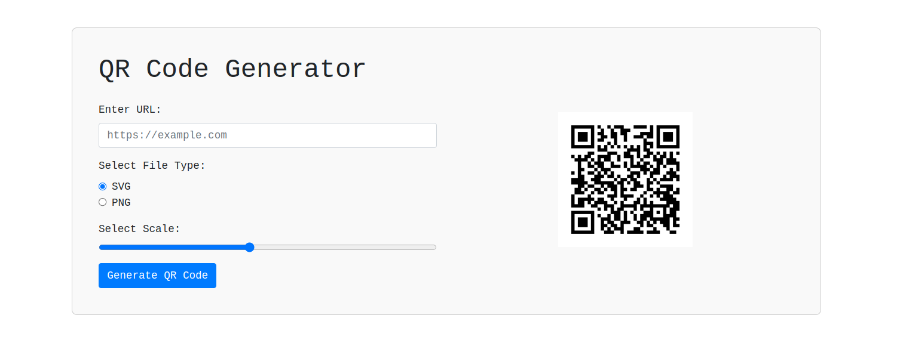

# QR Code Generator using Flask

This Python application creates QR codes from provided URLs using Flask, a web application framework. Users can input a URL, select the file type (SVG or PNG), and adjust the scale of the generated QR code.

## Features
- **Input:** Allows users to enter a URL for which they want to generate a QR code.
- **File Type Selection:** Provides options to save the QR code as SVG or PNG.
- **Scaling:** Allows users to adjust the size of the QR code using a slider.
- **Generation:** Generates and displays the QR code based on user inputs.
- **Output:** Shows the generated QR code along with a success message displaying the filename.

## Technologies Used
- **Flask:** Utilized for building the user interface and interactive elements.
- **PyQRCode:** Used to generate QR codes based on the provided URL.

## How to Use
1. Clone the repository.
2. cd qrcodegenerator
3. pip install -r requirements.txt
4. Run the application using `python qrcode.py`.
5. Input the URL, select the file type and scale, then click on "Generate QR Code".

Feel free to contribute, suggest improvements, or use this as a base for your QR code generation projects!
https://huggingface.co/spaces/muhammadnasar/qrcodegenerator
